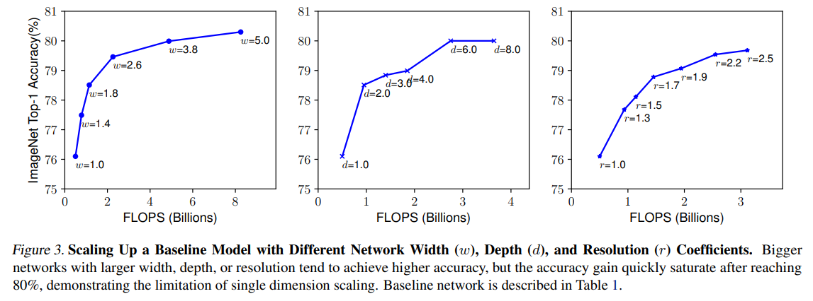
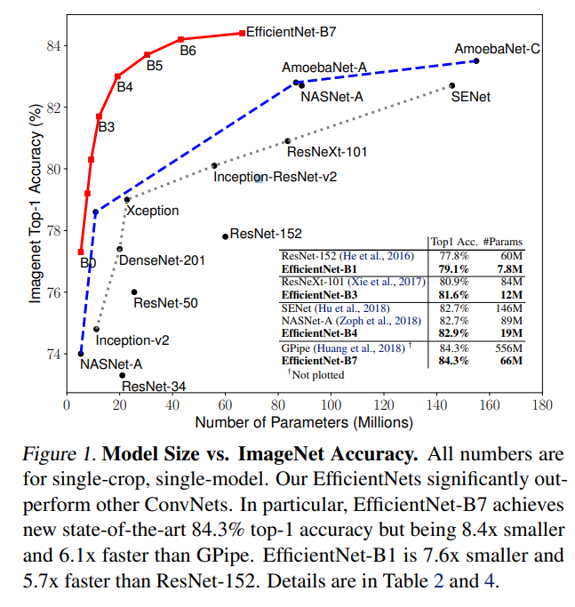

# EfficientNet

**EfficientNet: Rethinking Model Scaling for Convolutional Neural Networks**  
(Mingxing Tan, Quoc V. Le, Google, 2019)

---

## 1. 배경
기존 CNN 모델들은 성능을 높이기 위해 보통 다음 중 **한 가지만** 확장

- 네트워크 **깊이(depth)** 증가 (예: ResNet-50 → 101)
- 채널 수 **너비(width)** 증가
- 입력 이미지 **해상도(resolution)** 증가

### 문제점
- 어느 한 요소만 키우면 **연산량 대비 성능 향상이 비효율적**
- 모델 확장이 **경험적·비체계적**
- 모바일/엣지 환경에서는 사용이 어려움

👉 논문의 질문:
> “CNN 모델을 키울 때, 가장 효율적인 확장 방법은 무엇인가?”
---

## 2. EfficientNet의 핵심 아이디어: Compound Scaling

EfficientNet은 **깊이·너비·해상도를 동시에, 균형 있게 확장**하는 **Compound Scaling** 방법을 제안

### 기본 개념
- 단일 스케일 계수 `φ(phi)`를 기준으로 세 요소를 **고정된 비율**로 함께 증가

👉 의미:
> 같은 연산 예산 내에서 **가장 효율적인 방향으로 모델을 확장**

---

## 3. EfficientNet 기본 구조

### 3.1 Baseline: EfficientNet-B0
- Neural Architecture Search(NAS)를 통해 설계
- 모바일 환경을 고려한 경량 CNN

### 3.2 핵심 블록: MBConv
EfficientNet은 **MBConv (Mobile Inverted Bottleneck Convolution)** 블록을 사용한다.

MBConv 구성:
1. 1×1 Conv (채널 확장)
2. Depthwise Conv (3×3 또는 5×5)
3. Squeeze-and-Excitation (SE)
4. 1×1 Conv (채널 축소)
5. Skip Connection

👉 MobileNet + ResNet + SE 구조의 결합

---

## 4. EfficientNet 모델 패밀리

EfficientNet은 B0를 기준으로 Compound Scaling을 적용해 B1 ~ B7 모델을 생성한다.

| 모델 | 입력 해상도 | 파라미터 수(대략) | 특징 |
|---|---:|---:|---|
| B0 | 224×224 | ~5.3M | 기준 모델 |
| B1 | 240×240 | ~7.8M | 소폭 확장 |
| B2 | 260×260 | ~9.2M | 해상도 증가 |
| B3 | 300×300 | ~12M | 실무에서 자주 사용 |
| B4 | 380×380 | ~19M | 고성능 |
| B5 | 456×456 | ~30M | 대형 모델 |
| B6 | 528×528 | ~43M | 서버/연구용 |
| B7 | 600×600 | ~66M | ImageNet SOTA |

---

## 5. 실험 결과 (Results)

### ImageNet 분류 성능
- EfficientNet-B7:
  - **Top-1 Accuracy: 84.3%**
  - 기존 CNN 대비 **훨씬 적은 파라미터와 FLOPs**

### 핵심 성과
- 같은 정확도에서:
  - **ResNet 대비 8배 적은 파라미터**
  - **연산량(FLOPs) 대폭 감소**
- 모바일 환경에서도 우수한 성능

---

## 6. 논문의 주요 기여 (Contributions)

1. **Compound Scaling**이라는 체계적인 모델 확장 방법 제시
2. 효율성과 정확도를 동시에 달성한 CNN 패밀리 제안
3. “모델을 키우는 방법” 자체를 연구 주제로 끌어올림
4. 이후 EfficientNetV2, ConvNeXt, RegNet 등에 큰 영향

---

## 7. 한계 및 후속 연구
- 입력 해상도가 커질수록 **메모리 사용량 급증**
- 학습 속도가 느림 → **EfficientNetV2**에서 개선
- Transformer 계열 등장 이후 SOTA 자리는 점차 이동

---

## 8. 참고

※ 논문 원문  
https://arxiv.org/pdf/1905.11946.pdf

※ 논문 소개 블로그  
https://rahites.tistory.com/97  
https://wandukong.tistory.com/20#google_vignette
