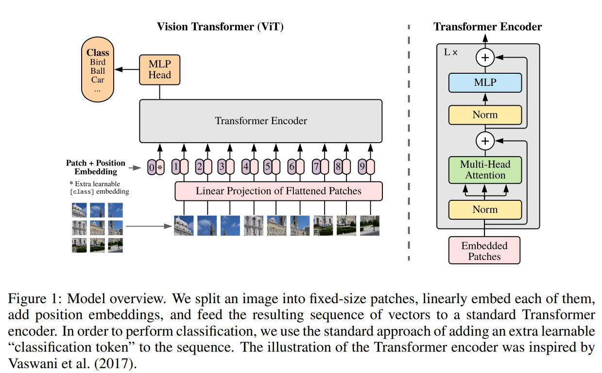
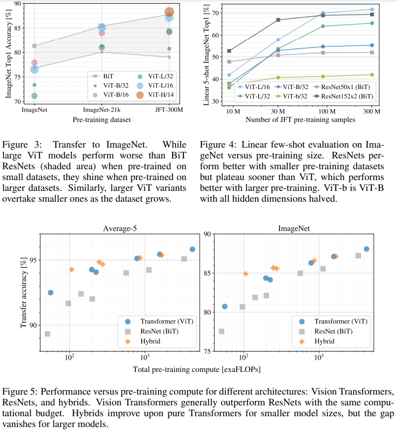

# Vision Transformer (ViT) 논문 요약

**논문명**: *An Image is Worth 16x16 Words: Transformers for Image Recognition at Scale*  
**저자**: Alexey Dosovitskiy et al. (Google Research)  
**발표 연도**: 2020  
**분야**: 이미지 분류 (Image Classification)

---

## 1. 연구 배경 (Motivation)

기존 이미지 인식 분야에서는 **CNN(ResNet 등)** 이 표준이었다.  
CNN은 지역성(locality), 평행이동 불변성(inductive bias)을 구조적으로 내장해  
**적은 데이터에서도 잘 학습**되는 장점이 있다.

하지만 NLP 분야에서는 이미 **Transformer가 CNN/RNN을 대체**한 상황이었고,  
연구자들은 다음 질문을 던졌다.

> “이미지 인식에서도 CNN 없이  
> Transformer만으로 좋은 성능을 낼 수 있을까?”

---

## 2. ViT의 핵심 아이디어

### 🔑 핵심 개념
> **이미지를 단어 시퀀스처럼 다루자**

ViT는 이미지를 **패치(patch) 단위 토큰 시퀀스**로 변환하여  
표준 Transformer Encoder에 입력한다.

---

## 3. ViT의 처리 방식

1. 입력 이미지를 고정 크기 패치로 분할  
   - 예: 224×224 → 16×16 패치 → 196개 패치
2. 각 패치를 벡터로 펼쳐 **Linear Embedding**
3. 위치 정보를 담기 위해 **Position Embedding** 추가
4. `[CLS]` 토큰을 함께 Transformer Encoder에 입력
5. `[CLS]` 토큰 출력을 이용해 분류 수행

👉 **CNN 연산(Conv, Pooling) 없이 Transformer만 사용**

출처: https://github.com/lucidrains/vit-pytorch/blob/main/images/vit.gif

---

## 4. ViT 구조 요약

Image  
→ Patch Embedding  
→ Position Embedding  
→ Transformer Encoder (Multi-Head Self-Attention)  
→ [CLS] Token  
→ MLP Head  
→ Classification

### 구조적 특징
- Self-Attention으로 **이미지 전역 문맥을 한 번에 학습**
- receptive field 개념이 처음부터 전체 이미지

---

## 5. CNN과 ViT의 근본적 차이

| 구분 | CNN (ResNet 등) | ViT |
|---|---|---|
| 기본 단위 | 픽셀 / 국소 커널 | 패치(Token) |
| 정보 결합 | 계층적으로 점진적 | 전역적(Self-Attention) |
| Inductive Bias | 강함 | 약함 |
| 데이터 요구량 | 적음 | 매우 큼 |
| 확장성 | 구조 변경 필요 | 모델 크기 확장 용이 |

---

## 6. 논문의 핵심 실험 결과

### 주요 관찰
- **대규모 데이터셋에서 ViT는 CNN을 능가**
- 소규모 데이터에서는 ViT 성능이 크게 저하

### 결론
- ViT는 **충분히 큰 데이터와 사전학습이 필수**
- 데이터 규모가 성능의 핵심 요소

---

## 7. ViT 논문의 주요 기여 (Contributions)

1. CNN 없이도 이미지 분류가 가능함을 최초로 입증
2. Vision 분야에 Transformer 패러다임 도입
3. 대규모 데이터에서 CNN의 inductive bias가 필수가 아님을 증명
4. 이후 다양한 후속 연구의 출발점 제공
   - DeiT
   - Swin Transformer
   - BEiT
   - MAE

---

## 8. ViT의 한계

- ❌ 데이터가 적으면 성능 급락
- ❌ Self-Attention의 계산량이 큼 (O(N²))
- ❌ 고해상도 입력에서 비효율적

👉 이러한 한계를 개선하기 위해  
**Swin Transformer, DeiT, Hybrid CNN+ViT** 등이 등장

---

## 9. 요약

> **ViT는 “이미지를 바라보는 방식을 CNN에서 Transformer로 확장시킨 전환점이 된 논문”이다.**

---

## 10. 참고 링크

※ 논문 원본  
https://arxiv.org/pdf/2010.11929.pdf

※ 논문 리뷰 블로그  
https://engineer-mole.tistory.com/133#google_vignette
https://hipgyung.tistory.com/entry/%EC%89%BD%EA%B2%8C-%EC%9D%B4%ED%95%B4%ED%95%98%EB%8A%94-ViTVision-Transformer-%EB%85%BC%EB%AC%B8-%EB%A6%AC%EB%B7%B0-An-Image-is-Worth-16x16-Words-Transformers-for-Image-Recognition-at-Scale
