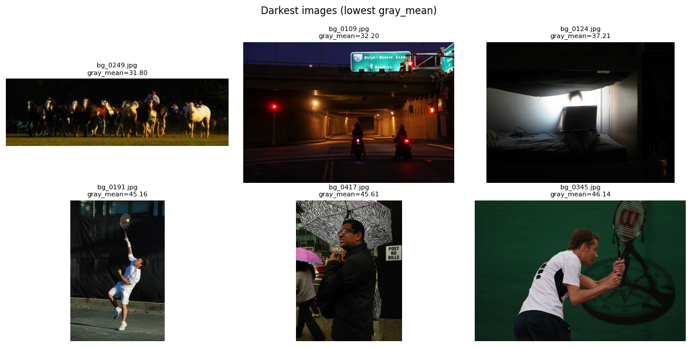
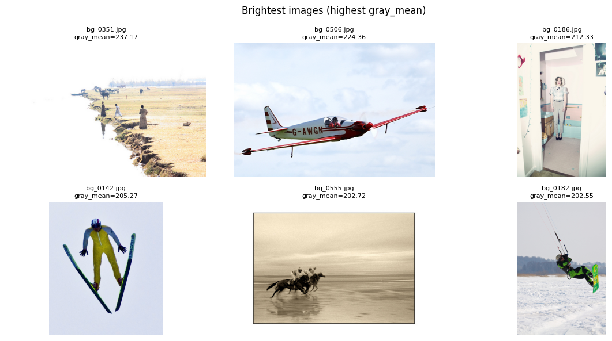
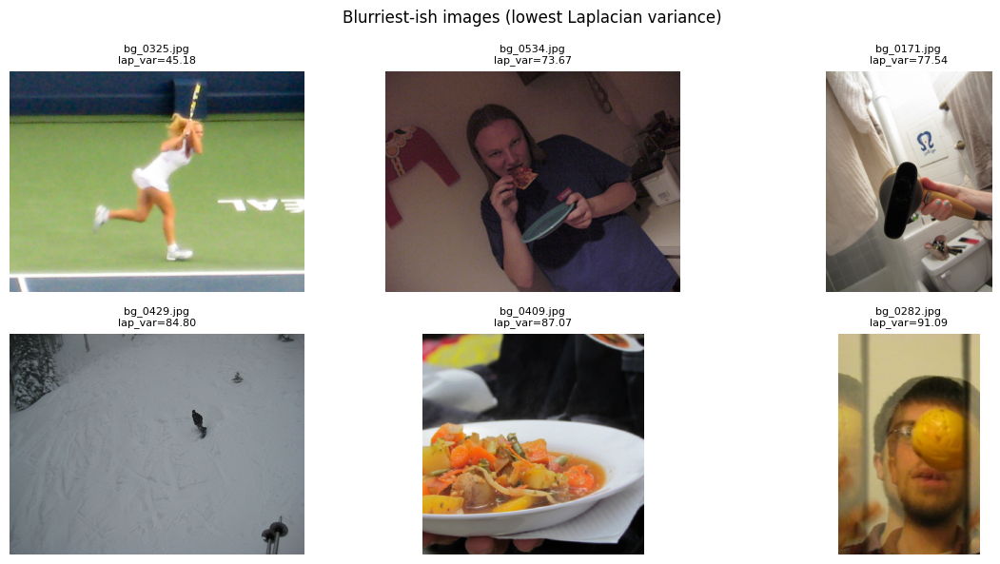
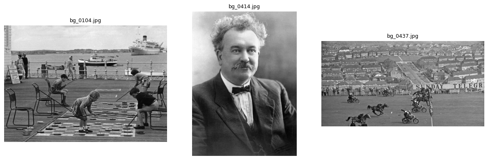

# Background Image Dataset – EDA Report

---

## 0. Image Samples

## 1. Dataset Overview

| 항목 | 값 |
|---|---|
| 이미지 수 | **600 장** |
| 전체 용량 | **88.84 MB** |
| 평균 파일 크기 | 151.62 KB |
| 중앙값 파일 크기 | 145.15 KB |
| 최소 / 최대 파일 크기 | 27.24 KB / 502.75 KB |
| 이미지 포맷 | JPG (100%) |

- 모든 파일은 `.jpg` 형식으로 구성되어 있음
- 손상되거나 읽을 수 없는 이미지 없음

---

## 2. Image Channels & Color Mode

### Channel 분포
| Channels | Count |
|---|---|
| 3 (RGB) | 597 |
| 1 (Grayscale) | 3 |

### PIL Mode 분포
| Mode | Count |
|---|---|
| RGB | 597 |
| L (Grayscale) | 3 |

➡️ **대부분 RGB 이미지**, 극소수의 Grayscale 이미지 존재

---

## 3. Resolution & Aspect Ratio Analysis

### 기본 통계 (유효 이미지 기준)

| 항목 | Mean | Min | Median | Max |
|---|---|---|---|---|
| Width (px) | 567.7 | 240 | 640 | 640 |
| Height (px) | 483.5 | 169 | 480 | 640 |
| Megapixels | 0.27 | 0.08 | 0.27 | 0.41 |
| Aspect Ratio (W/H) | 1.24 | 0.56 | 1.33 | 3.79 |

### 해상도 분포 (Top 10)

| Resolution | Count |
|---|---|
| 640 × 480 | 109 |
| 640 × 427 | 77 |
| 480 × 640 | 37 |
| 500 × 375 | 34 |
| 640 × 426 | 27 |
| 427 × 640 | 26 |
| 640 × 428 | 20 |
| 640 × 425 | 18 |
| 375 × 500 | 14 |
| 612 × 612 | 10 |

➡️ **640 계열 해상도가 지배적**, 가로/세로 방향 이미지 혼재

---

## 4. Brightness & Exposure Analysis

- Dark images (gray_mean < 40): **3장**
- Bright images (gray_mean > 215): **2장**

➡️ **노출이 극단적으로 치우친 이미지는 거의 없음**

---

## 5. Image Quality & Integrity

### Corruption Check
- 손상 이미지: **0 / 600**

### Near-Duplicate Check (pHash)
- Exact duplicate groups: **0**
- Approximate duplicate pairs (Hamming ≤ 6): **0**

➡️ **중복 이미지 없음 → 데이터 다양성 양호**

---

## 6. Dataset-level Color Statistics

(이미지별 평균을 다시 평균낸 근사값)

- **RGB Mean** ≈ `[118.85, 113.86, 105.74]`
- **RGB Std** ≈ `[62.67, 60.50, 60.87]`

➡️ 일반적인 ImageNet 평균과는 다소 차이 존재

---

## 7. Key Insights from EDA 🔍

### 1️⃣ 데이터 품질
- 손상/중복 이미지 없음 → **데이터 정합성 매우 우수**
- 밝기/노출 극단치 거의 없음 → **노이즈 필터링 필요성 낮음**

### 2️⃣ 해상도 & 전처리 전략
- 해상도 분포가 **640×480 중심**
- 다양한 종횡비 존재 (portrait / landscape 혼재)
👉 **모델 입력 시 Resize + Padding(letterbox) 전략 권장**

### 3️⃣ 채널 불일치 이슈
- Grayscale 이미지 3장 존재
👉 학습 전 **RGB 강제 변환** 필요

### 4️⃣ 정규화(Normalization) 인사이트
- 데이터셋 고유 RGB mean/std가 ImageNet과 다름
👉 사전학습 모델 사용 시
- (선택) ImageNet mean/std 유지
- (대안) 본 데이터셋 mean/std로 fine-tuning 실험 고려

### 5️⃣ Background 클래스 특성
- 중복 없고 장면 다양성 양호
- 차량/파손 데이터와 결합 시  
  **False Positive 감소용 Negative 샘플로 매우 적합**

