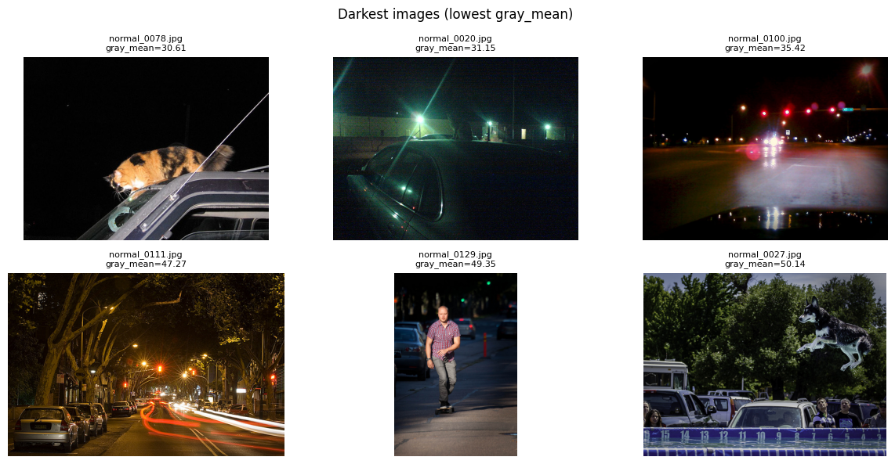
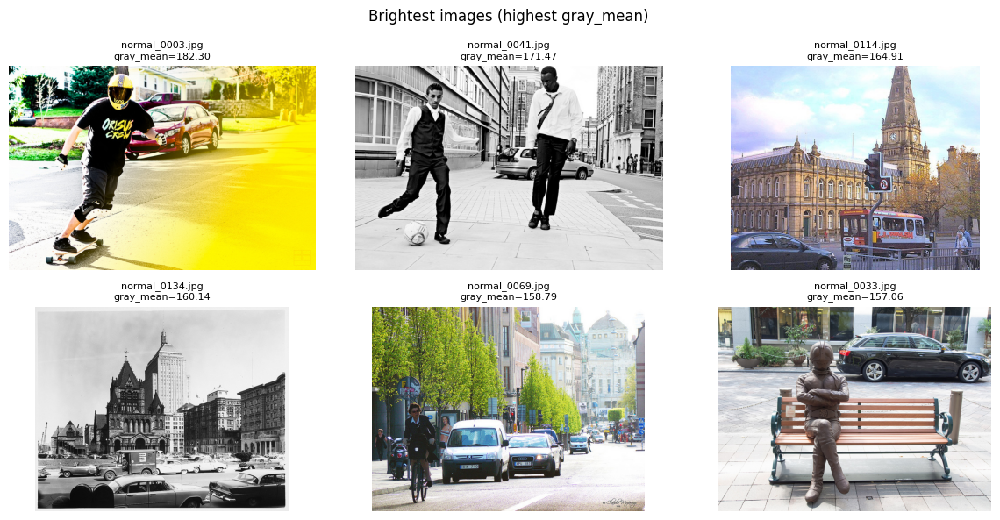
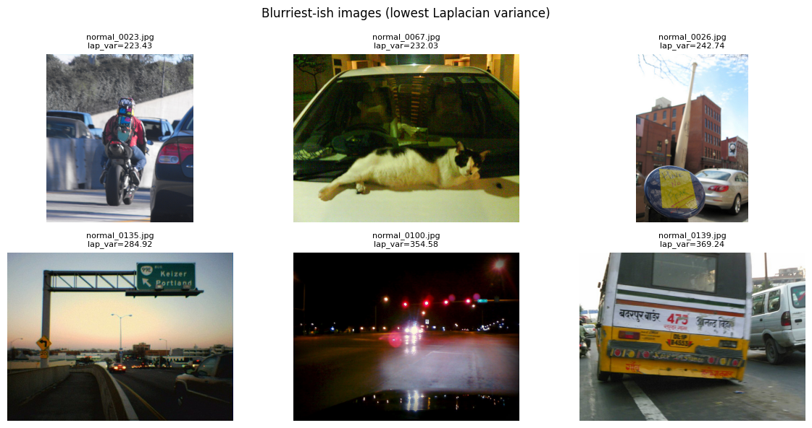

# Background Image Dataset – EDA Report

---

## 0. Image Samples

## 1. Dataset Overview

| 항목 | 값 |
|---|---|
| 이미지 수 | **157 장** |
| 전체 용량 | **25.90 MB** |
| 평균 파일 크기 | 168.90 KB |
| 중앙값 파일 크기 | 162.22 KB |
| 최소 / 최대 파일 크기 | 34.22 KB / 418.94 KB |
| 이미지 포맷 | JPG (100%) |

- 모든 이미지가 `.jpg` 형식
- 손상되거나 읽을 수 없는 이미지 없음

---

## 2. Image Channels & Color Mode

### Channel 분포
| Channels | Count |
|---|---|
| 3 (RGB) | 157 |

### PIL Mode 분포
| Mode | Count |
|---|---|
| RGB | 157 |

➡️ **모든 이미지가 RGB로 통일**, 데이터 정합성 우수

---

## 3. Resolution & Aspect Ratio Analysis

### 기본 통계 (유효 이미지 기준)

| 항목 | Mean | Min | Median | Max |
|---|---|---|---|---|
| Width (px) | 583.7 | 220 | 640 | 640 |
| Height (px) | 464.9 | 169 | 437 | 640 |
| Megapixels | 0.27 | 0.04 | 0.27 | 0.41 |
| Aspect Ratio (W/H) | 1.31 | 0.64 | 1.33 | 2.96 |

### 해상도 분포 (Top 10)

| Resolution | Count |
|---|---|
| 640 × 480 | 39 |
| 640 × 427 | 22 |
| 640 × 426 | 11 |
| 500 × 375 | 10 |
| 480 × 640 | 7 |
| 500 × 333 | 5 |
| 640 × 428 | 4 |
| 427 × 640 | 4 |
| 426 × 640 | 3 |
| 428 × 640 | 2 |

➡️ **640px 기준 해상도가 지배적**, 세로/가로 이미지 혼재

---

## 4. Brightness & Exposure Analysis

- Dark images (gray_mean < 40): **3장**
- Bright images (gray_mean > 215): **0장**

➡️ 대부분 적정 노출, 극단적으로 밝은 이미지는 없음

※ gray_mean < 40

---

## 5. Image Quality & Integrity

### Corruption Check
- 손상 이미지: **0 / 157**

### Near-Duplicate Check (pHash)
- Exact duplicate groups: **0**
- Approximate duplicate pairs (Hamming ≤ 6): **0**

➡️ **중복 이미지 없음**, 데이터 다양성 양호

---

## 6. Dataset-level Color Statistics

(이미지별 평균을 다시 평균낸 근사값)

- **RGB Mean** ≈ `[113.14, 111.44, 106.17]`
- **RGB Std** ≈ `[67.23, 66.87, 68.16]`

---

## 7. Key Insights from EDA 🔍

### 1️⃣ 데이터 품질
- 손상·중복 이미지 전무
- RGB 채널 완전 통일 → **전처리 부담 매우 낮음**

### 2️⃣ 해상도 특성
- 대부분 640 기반 해상도
- Background / Damaged 데이터셋과 **해상도 스케일 유사**
👉 하나의 공통 입력 해상도 전략 적용 가능

### 3️⃣ 밝기 분포
- Dark 이미지 소수(3장), Bright 이미지 없음
👉 노출 관련 데이터 클리닝 필요성 낮음

### 4️⃣ Normal 클래스의 역할
- 시각적으로 안정적인 이미지가 다수
- Vehicle/Damaged 분류 시  
  **False Positive를 억제하는 기준 클래스**로 적합

### 5️⃣ 정규화(Normalization) 관점
- Background 데이터셋과 RGB mean/std가 유사
👉 클래스별 정규화 분리 없이  
**통합 mean/std 사용 가능성 높음**

---
