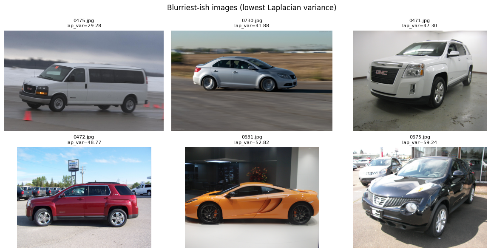
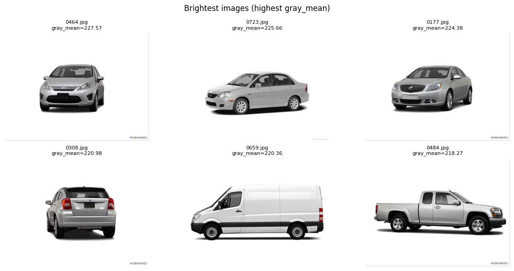
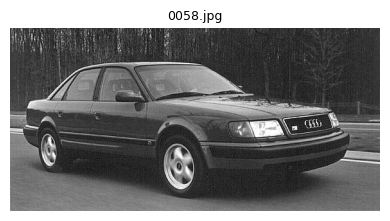
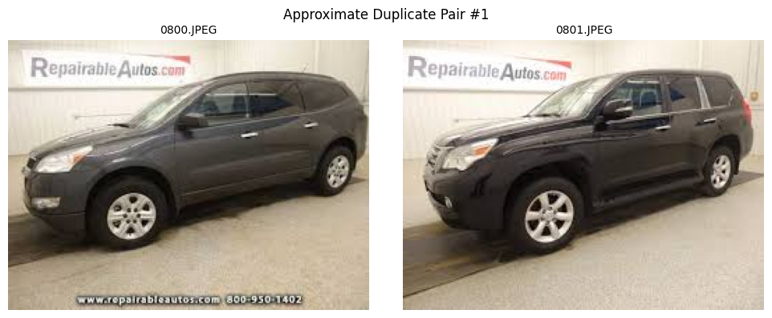
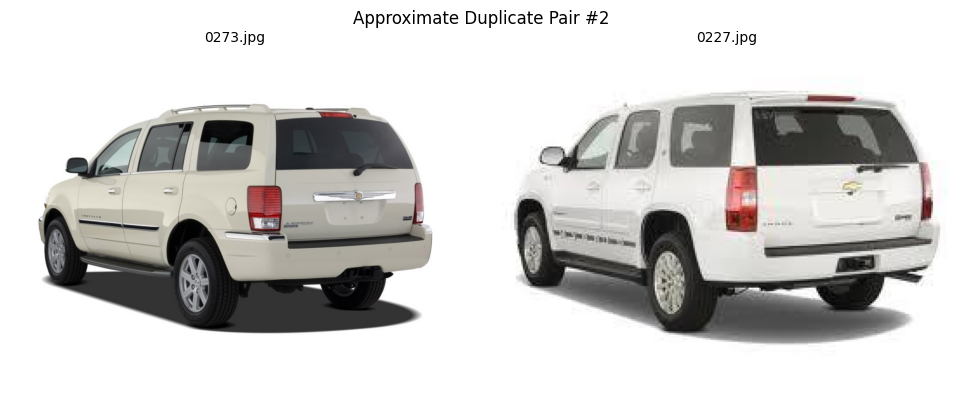

# Nromal(kaggle) Image Dataset – EDA Report

---

## 0. Image Samples

  
  

## 1. Dataset Overview

| 항목 | 값 |
|---|---|
| 이미지 수 | **920 장** |
| 전체 용량 | **89.92 MB** |
| 평균 파일 크기 | 100.09 KB |
| 중앙값 파일 크기 | 44.11 KB |
| 최소 / 최대 파일 크기 | 2.04 KB / 6.23 MB |
| 이미지 포맷 | JPG (792), JPEG (128) |

- JPEG/JPG 혼합 데이터셋
- 모든 이미지 정상 로드 (손상 이미지 없음)

---

## 2. Image Channels & Color Mode

### Channel 분포
| Channels | Count |
|---|---|
| 3 (RGB) | 919 |
| 1 (Grayscale) | 1 |

### PIL Mode 분포
| Mode | Count |
|---|---|
| RGB | 919 |
| L (Grayscale) | 1 |

➡️ **대부분 RGB**, Grayscale 이미지 1장은 예외 케이스로 관리 필요

---

## 3. Resolution & Aspect Ratio Analysis

### 기본 통계 (유효 이미지 기준)

| 항목 | Mean | Min | Median | Max |
|---|---|---|---|---|
| Width (px) | 628.8 | 112 | 580 | 4912 |
| Height (px) | 432.9 | 80 | 368 | 3264 |
| M지

---

## 6. Dataset-level Color Statistics

(이미지별 평균을 다시 평균낸 근사값)

- **RGB Mean** ≈ `[120.37, 116.69, 115.38]`
- **RGB Std** ≈ `[67.13, 67.03, 67.96]`

➡️ 기존 Background / Normal 데이터셋과 **유사한 색상 분포**

---

## 7. Key Insights from EDA 🔍

### 1️⃣ 데이터 다양성
- 해상도, 파일 크기, 촬영 환경이 매우 다양
- 실제 서비스 환경에 가까운 **Generalization 강화용 데이터셋**

### 2️⃣ 전처리 전략 필수
- 해상도 편차가 매우 큼
👉 **Resize + Padding(letterbox)** 강제 필요  
👉 입력 해상도 통일 없이는 학습 불안정 가능성 높음

### 3️⃣ 데이터 정합성 이슈
- Grayscale 이미지 1장
- 근사 중복 이미지 2쌍
👉 학습 전 **정리(Data Cleaning)** 권장

### 4️⃣ 밝기 분포
- 과다 노출(Bright) 이미지가 상대적으로 많음
👉 밝기 증강(Augmentation) 시 상한값 주의

### 5️⃣ 기존 Normal 데이터와의 관계
- 내부 Normal 데이터셋 대비
  - 해상도 다양성 ↑
  - 노이즈 ↑
- **Fine-tuning 또는 보조 학습 데이터**로 매우 적합
